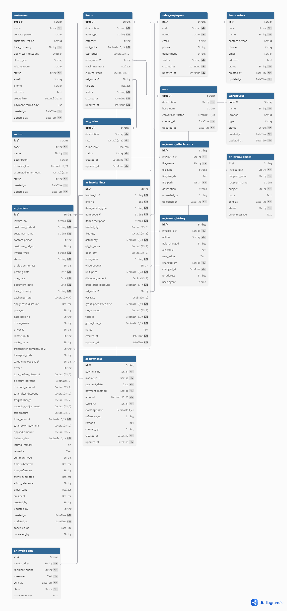

# Invoice Management System

A Java Swing desktop application for managing invoices with SQL Server database backend.


## Database Schema



- **Users**: Application users with authentication
- **Customer**: Customer information (code, name, address, phone, etc.)
- **Item**: Items/services catalog (number, description, unit, price)
- **SalesEmployee**: Sales team members
- **Invoice**: Invoice headers with customer, dates, totals
- **InvoiceLine**: Invoice line items with item details and amounts


## Features

- User authentication and registration
- Customer management
- Item/Service catalog
- Sales employee management
- Invoice creation with line items
- Automatic calculations (discounts, VAT, totals)
- Approval workflow for high-value invoices
- Modern UI with FlatLaf look and feel

## Prerequisites

### Option 1: Docker (Recommended)
- Docker Desktop installed and running
- X11 server for GUI display:
  - **Windows**: Install VcXsrv or Xming
  - **macOS**: Install XQuartz
  - **Linux**: X11 is usually pre-installed

### Option 2: Local Development
- Java 17 or higher
- Maven 3.9.6 or higher
- SQL Server 2022 (or Docker for database only)

## Running with Docker

### 1. Setup X11 Server (for GUI display)

#### Windows:
1. Download and install [VcXsrv](https://sourceforge.net/projects/vcxsrv/)
2. Launch XLaunch from Start Menu
3. Select "Multiple windows", set Display number to 0
4. Select "Start no client"
5. **Important**: Check "Disable access control"
6. Finish setup

#### macOS:
```bash
# Install XQuartz
brew install --cask xquartz

# Start XQuartz and enable network connections
open -a XQuartz

# In XQuartz preferences:
# - Go to Security tab
# - Check "Allow connections from network clients"
# - Restart XQuartz

# Allow localhost connections
xhost + localhost
```

#### Linux:
```bash
# Allow Docker containers to connect to X11
xhost +local:docker
```

### 2. Start the Application

```bash
# Start all services (database + app)
docker-compose up --build

# Or run in detached mode
docker-compose up --build -d
```

The application will:
1. Start SQL Server container
2. Initialize the database with schema and sample data
3. Build and start the invoice application
4. Display the login window

### 3. Login Credentials

Default credentials:
- **Username**: admin
- **Password**: admin123

Sample data includes:
- 3 customers (CUST001, CUST002, CUST003)
- 5 items/services
- 3 sales employees

### 4. Stop the Application

```bash
# Stop all services
docker-compose down

# Stop and remove volumes (clears database)
docker-compose down -v
```

## Local Development Setup

### 1. Start SQL Server (Docker)

```bash
# Start SQL Server container
docker-compose up sqlserver

# Or use docker run directly
docker run -e "ACCEPT_EULA=Y" -e "SA_PASSWORD=ArInvoice2024!" -p 1433:1433 --name invoice-sqlserver -d mcr.microsoft.com/mssql/server:2022-latest
```

### 2. Initialize Database

```bash
# Connect to SQL Server and create database
sqlcmd -S localhost -U sa -P ArInvoice2024! -Q "CREATE DATABASE invoice_db"

# Run schema script
sqlcmd -S localhost -U sa -P ArInvoice2024! -d invoice_db -i src/main/resources/schema.sql
```

### 3. Build and Run Application

```bash
# Build with Maven
./mvnw clean package

# Run the application
java -jar target/invoice-management-system-1.0-SNAPSHOT.jar
```

## Configuration

### Database Connection

The application supports two configuration methods:

1. **Environment Variables** (used by Docker):
   - `DB_SERVER`: Database server hostname (default: sqlserver)
   - `DB_PORT`: Database port (default: 1433)
   - `DB_NAME`: Database name (default: invoice_db)
   - `DB_USER`: Database username (default: sa)
   - `DB_PASSWORD`: Database password (default: ArInvoice2024!)

2. **Properties File** (used for local development):
   - Edit `src/main/resources/database.properties`
   - Configure connection URL, username, and password

## Project Structure

```
invoice-management-system/
├── src/
│   └── main/
│       ├── java/
│       │   └── com/grainindustries/invoice/
│       │       ├── dao/           # Database access layer
│       │       ├── model/         # Entity classes
│       │       ├── service/       # Business logic layer
│       │       ├── ui/            # Swing UI components
│       │       └── util/          # Utilities (DB connection, etc.)
│       └── resources/
│           ├── database.properties
│           └── schema.sql         # Database schema with sample data
├── docker/
│   └── Dockerfile                 # Multi-stage build for app
├── docker-compose.yml             # Docker orchestration
└── pom.xml                        # Maven configuration
```

## Troubleshooting

### GUI not displaying (Docker)
- Ensure X11 server is running
- Check DISPLAY environment variable is set correctly
- On Windows, ensure VcXsrv "Disable access control" is checked
- On macOS, ensure XQuartz allows network connections
- On Linux, run `xhost +local:docker`

### Database connection error
- Ensure SQL Server container is healthy: `docker-compose ps`
- Check logs: `docker-compose logs sqlserver`
- Verify credentials match in docker-compose.yml

### Build errors
- Ensure Java 17 is installed: `java -version`
- Clean Maven cache: `./mvnw clean`
- Check network connectivity for Maven dependencies

## Business Rules

- **VAT Rate**: 16% applied to invoice total
- **Discount Validation**: Maximum 50% discount allowed
- **Approval Workflow**: Invoices over 10,000 require approval
- **Required Fields**: Customer, remarks, and at least one line item

## Technologies Used

- **Java 17**: Programming language
- **Swing**: GUI framework
- **FlatLaf 3.2.5**: Modern look and feel
- **JCalendar 1.4**: Date picker components
- **SQL Server 2022**: Database
- **Maven**: Build tool and dependency management
- **Docker**: Containerization

